# Clinical Trial Data Analysis - User Flow & Technical Architecture

## 📋 User Flow Diagrams

### Primary User Journey: Natural Language Query to Dashboard

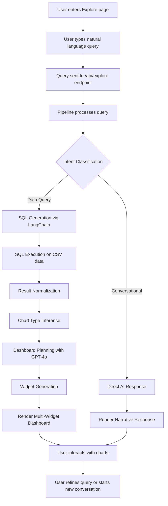

### Dashboard Generation Flow

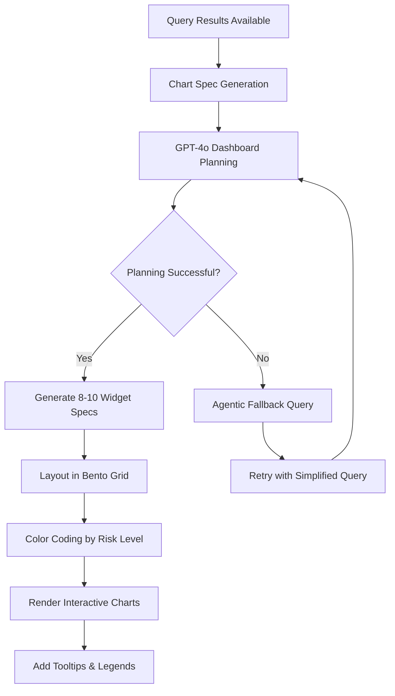

### Data Processing Pipeline

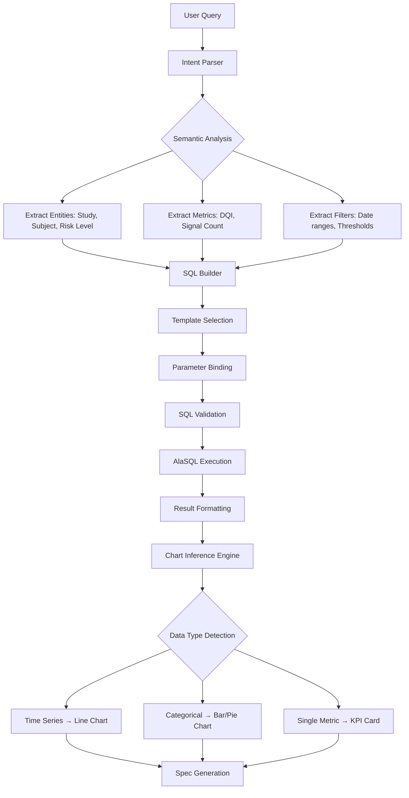

## 🏗️ Technical Architecture

### System Components Architecture

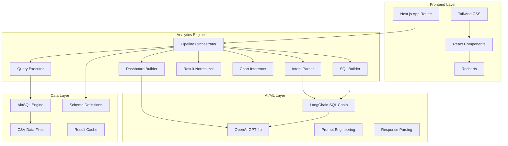

### Component Interaction Flow

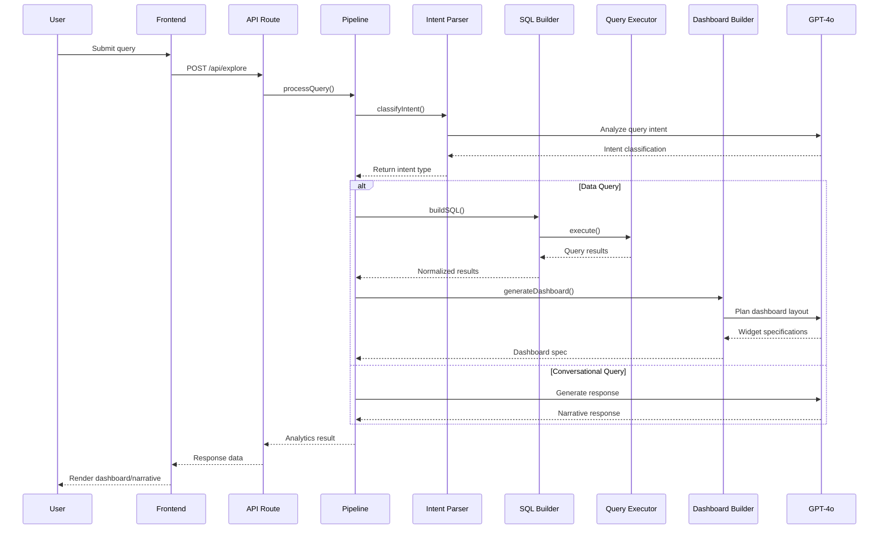

### Data Schema Architecture

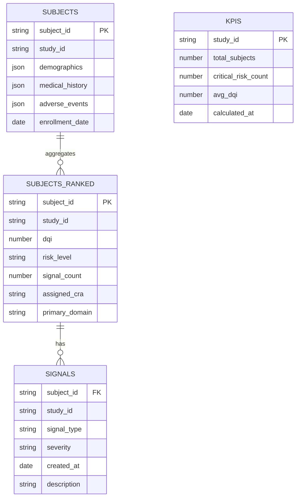

## 🔄 Detailed Component Flows

### Intent Parsing Flow

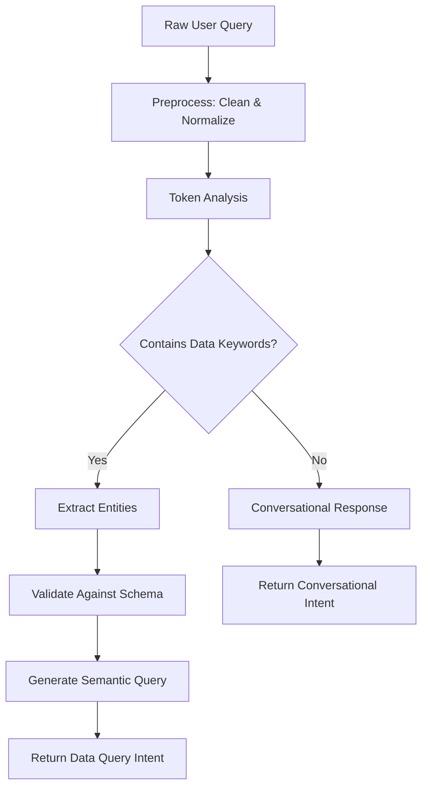

### SQL Generation Flow

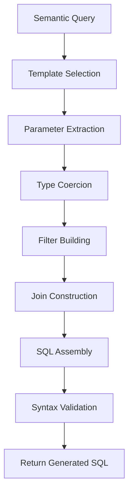

### Chart Inference Flow

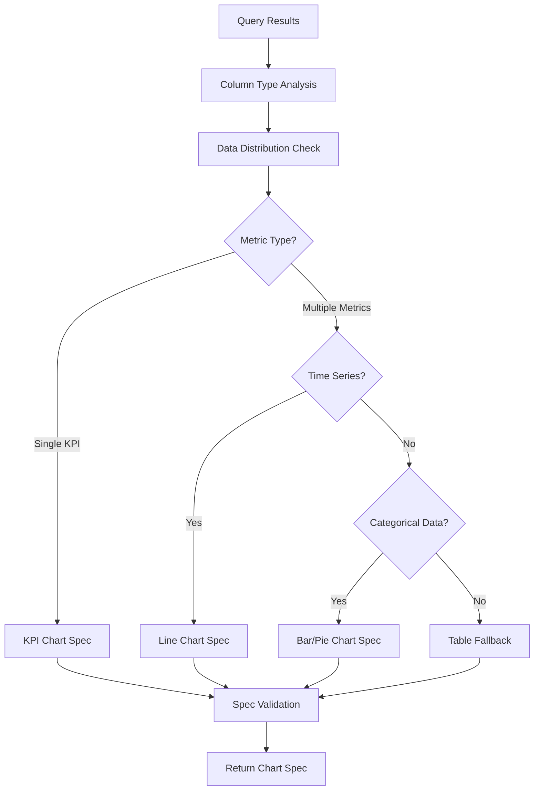

## 📊 Dashboard Layout Algorithm

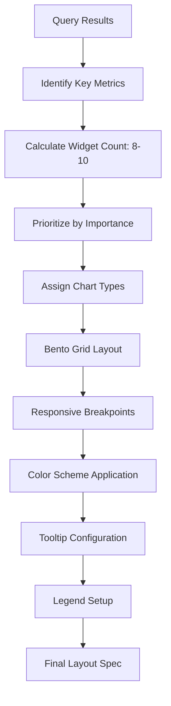

## 🚨 Error Handling & Fallbacks

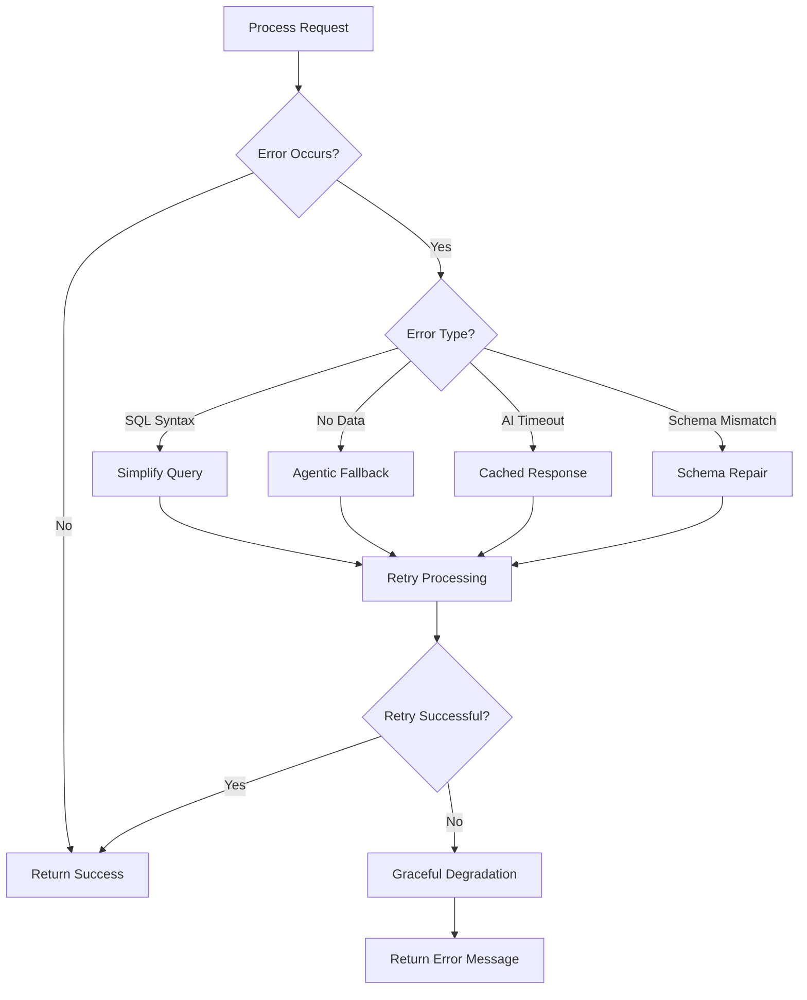

## 🔧 Configuration & Customization

### Chart Type Selection Matrix

| Data Type | Metric Count | Time Dimension | Preferred Chart |
|-----------|-------------|----------------|-----------------|
| Numeric | 1 | No | KPI Card |
| Numeric | 1 | Yes | Line Chart |
| Numeric | 2-5 | No | Bar Chart |
| Numeric | 2-5 | Yes | Multi-Line Chart |
| Categorical | Any | No | Pie Chart |
| Mixed | Any | Any | Table View |

### Risk Level Color Mapping

```json
{
  "Critical": "#ef4444",
  "High": "#f97316",
  "Medium": "#eab308",
  "Low": "#22c55e"
}
```

### Responsive Breakpoint System

```css
/* Mobile First */
.grid-cols-1 /* 1 column on mobile */
@media (min-width: 768px) { .md:grid-cols-2 } /* 2 columns on tablet */
@media (min-width: 1024px) { .lg:grid-cols-3 } /* 3 columns on desktop */
@media (min-width: 1280px) { .xl:grid-cols-4 } /* 4 columns on large desktop */
```

## 📈 Performance Optimization Flows

### Query Caching Strategy

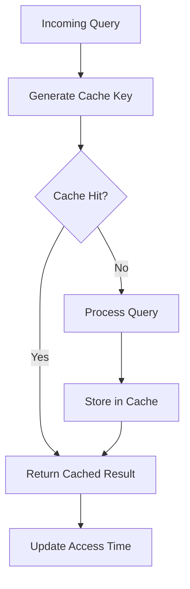

### Lazy Loading Implementation

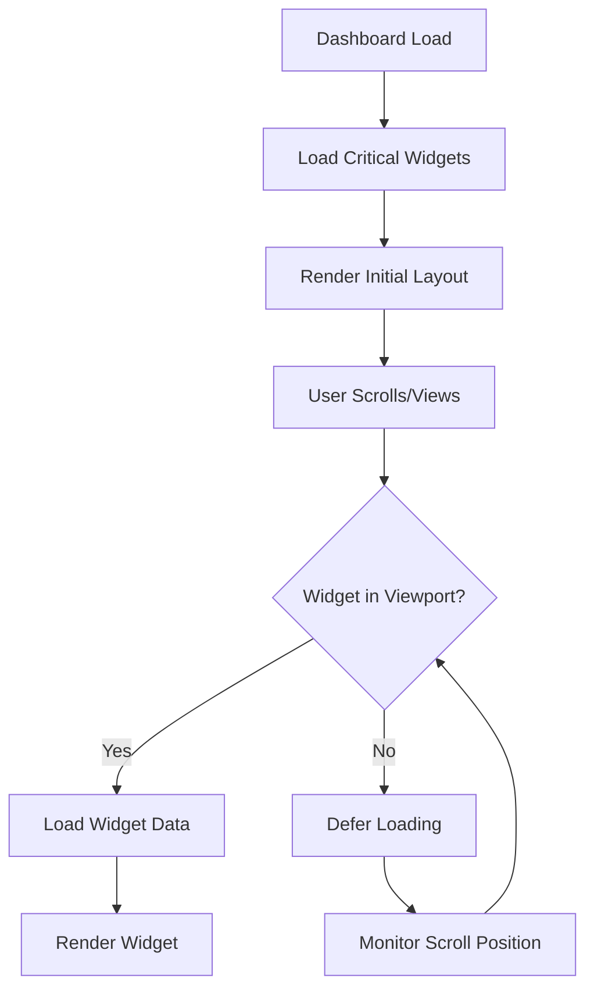

## 🔐 Security Architecture

### Input Validation Flow

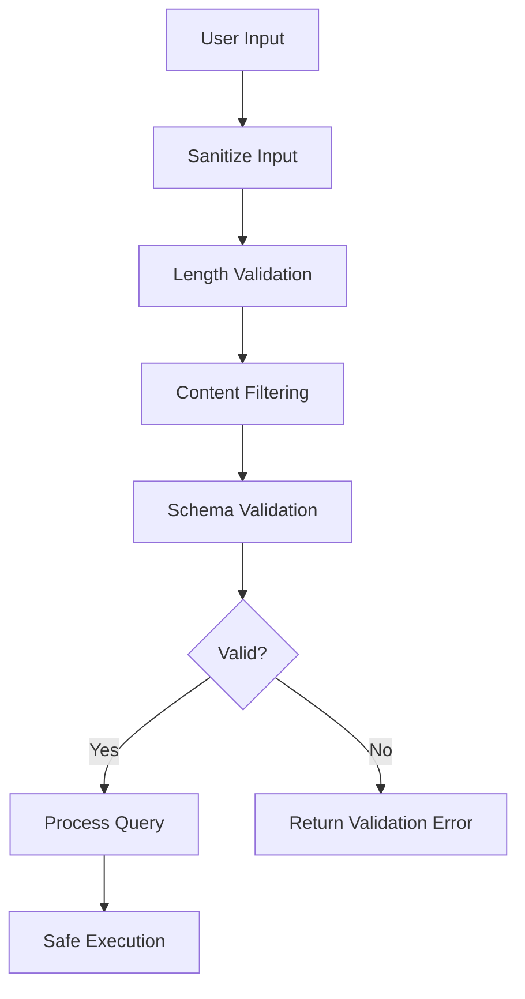

### API Security Measures

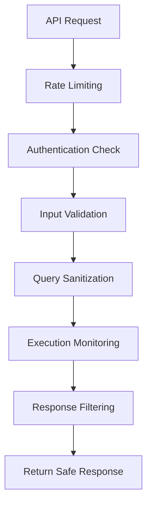

---

*This documentation provides comprehensive technical architecture and user flow diagrams for the Clinical Trial Data Analysis web application.*